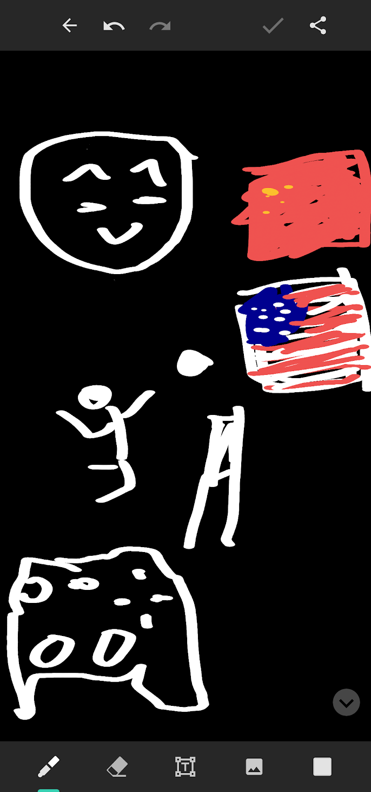
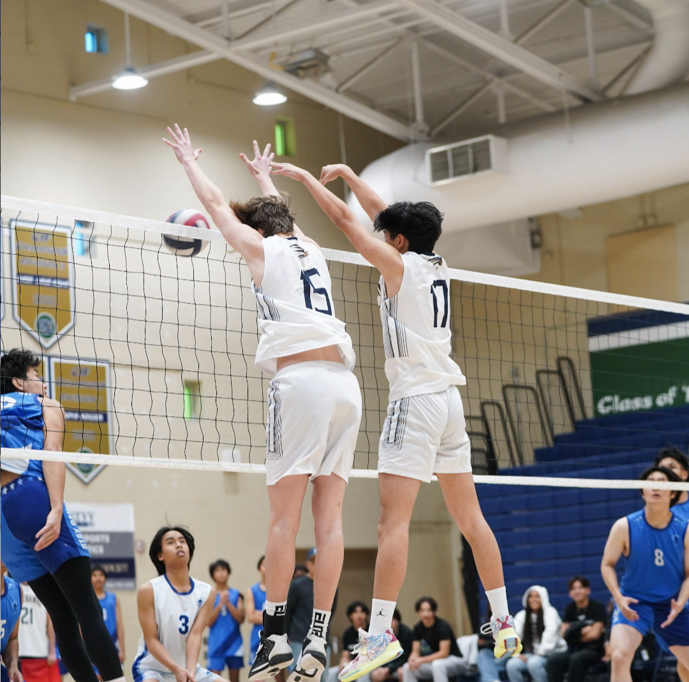
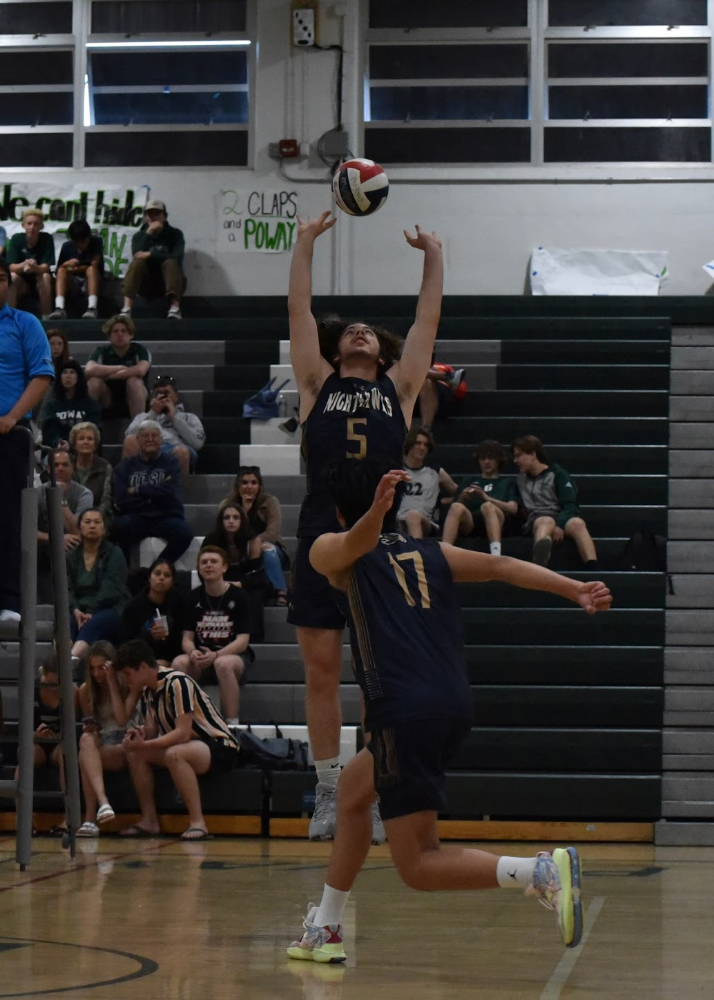

##  About Me 

 
My name is Jayden Chen, and I'm an 11th grader at Del Norte High School. Welcome to my blog!!

 
Here is my Freeform drawing!

 
This is me and my partner, Will! Prior to our parternship in the pair project, we've played volleyball together for multiple years.

 
In my free time, I like to play volleyball, go to the beach, and play video games.

 
I've been playing volleyball for about 4 years, inside and outside of school. I'm currently playing for at a volleyball club called Coast, where I get to compete with some of the highest level players. This year is also my third year playing for Del Norte's Varsity team.

 

 
 
Recently I've been pretty hooked on a video game called fortnite. I wish I could say that I was really good at it, but my aim is pretty terrible so I don't win too often.

 

[def]: eek1_ChallengesFaced.m